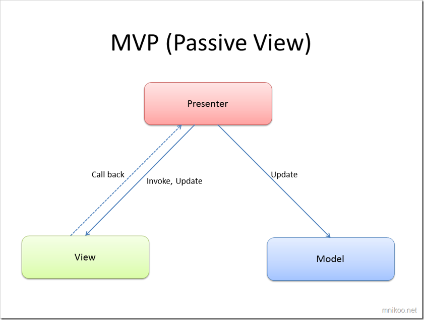
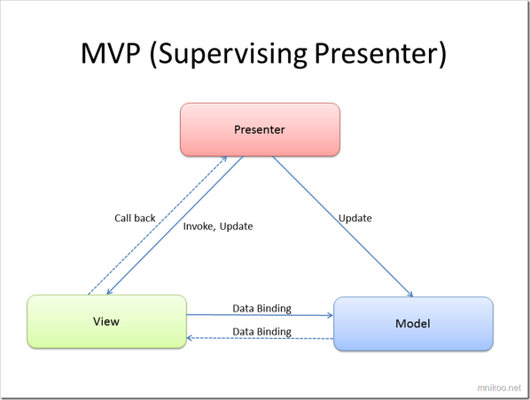

# MVC Pattern

## PART 1
### Introdução
O Padrão mvp é um padrão de arquitetura.

 

O Padrão tem como objetivo organizar uma aplicação dividindo as suas componentes em
- **Model**
    - Sabe tudo sobre, os dados persistentes  que devem ser apresentados;as operações que serão aplicadas para transformar os objectos.
    - Nada sabe sobre, as interfaces do utilizador, de como os dados serão mostrados, as acções das interfaces usadas para manipular os dados.
- **View**
    - Refere-se ao objecto Presenter;
    - Define como os dados serão visualizados pelo utilizador;
    - Recebe as notificações do Presenter, para atualizar a visualização dos dados.
- **Presenter**
    - Sincroniza as acções do View com as acções realizadas pelo Model;
    - Trabalha com a informação recebida pela View (com os eventos e pedidos solicitados por acções sobre os componentes da View), processa e envia o pedido ao Model;
    - É notificado pelo Model, das alterações realizadas, e em função disso atualiza a View.
## Exemplo

Pretende-se realizar uma aplicação para gerir a compra de produtos online - " carrinho de compras" que deverá ter a seguinte interface 

- **Model**
  - A classe `ShoppingCart` é responsável por gerir a lista de produtos que compoe o carrinho de compras.
- **View**
  - A classe `ShoppingCartUI` implementa em JavaFX a interface grafica do ShoppingCart.
  
- **Presenter**
  - A classe `ShoppingCartPresenter` é responsável por sincronizar as acções do View (pressionar os botões ) com as acções realizadas pelo Model. Esta sincronização é realizada pelo método doAddProduct, através dos métodos doAdd
  - É reponsável por solicitar à View para mostrar mensagens de alerta, caso a operação de adicionar Produto gere uma excepção.

### Exercício
1. Coloque um botão para remover produtos. E adicione o comportamento. 
2. Adicione um alarme, para quando o valor total do carrinho exceder um determinado valor. 
 - Nesse caso, não deve ser possivel adicionar mais produtos ao carrinho e o total deve ficar a vermelho.

## Parte 2

###Introdução
Existe uma variante do MVP : MVP Supervisoned Presenter. Esta variante permite que a View assuma alguma responsabilidade, especialmente no que toca à lógica simples de interface.
É usada em muitas arquitecturas JavaFX porque o JavaFX suporta data binding, o que se encaixa muito bem neste padrão.

**Características**

- O Presenter continua a ser responsável pela lógica de alto nível.

- A View pode: 
  - (i) realizar lógica básica da interface (activar/desactivar controlos, validação local), 
  - (ii) usar data binding directamente com o modelo,
  - (iii) actualizar componentes visuais sem ter de pedir ao Presenter para cada pequena alteração.
O **Presenter supervisiona** em vez de controlar tudo ao pormenor.

### Exercício
1. Estudo o código apresentado tendo em especial atenção a :
   - Declaração da variavel `products` na classe `ShoppingCart`
   - À implementação do método `databindingTotalCost`na classe `ShoppingCartUI`
   - À remoção do método `updateView` da classe `ShoppingCartUI`

2. Adicione a seguinte funcionalidade usando DataBinding
   - Introduza um novo label na View que indica o produto mais caro no carrinho.
   - **Nota**: Altere as classes que assume o papel de View e Model para implementar esta funcionaldiade.